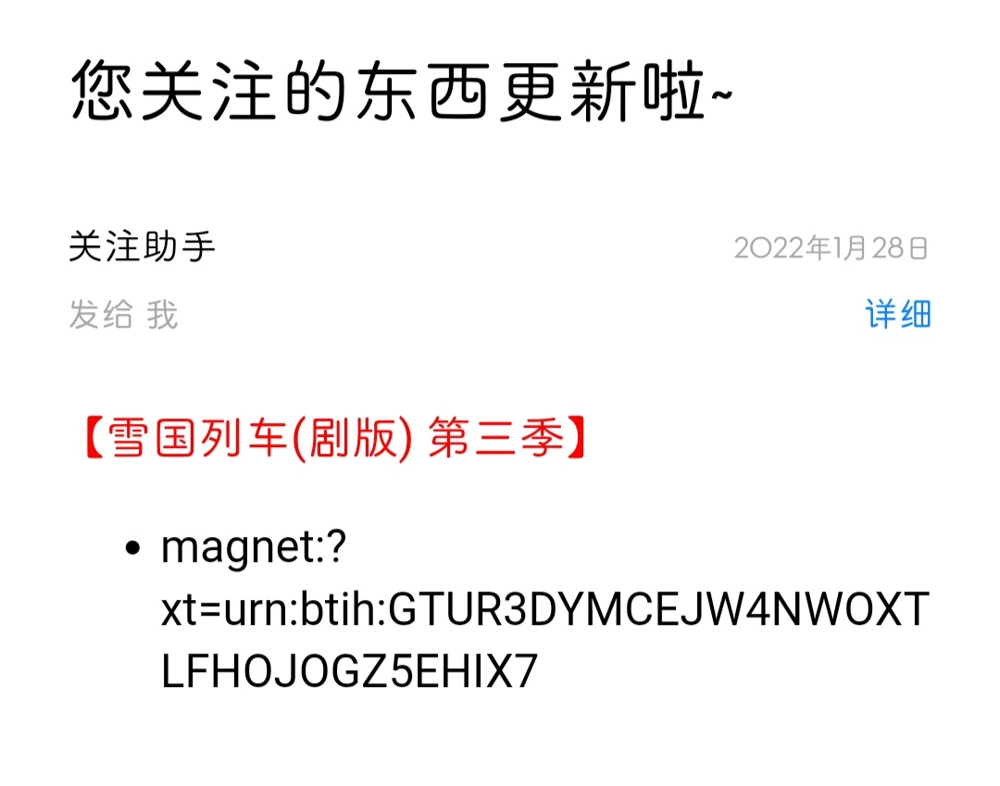

# ChangeDetection
> 监听web或者api内容变更, 该仓库是[花生酱的家庭流媒体](https://github.com/PPeanutButter/HomeMediaServer)的组成部分。


# usage&sample
> 在同级目录下建立任务文件`change_detection_tasks.json`, 其中任务示例如下：
```json
[
    {
        "title": "雪国列车(剧版) 第三季",
        "parser": {
            "type": "BTBTTParser", #该名称为解析器名字, 只能是core目录下的一个
            "selector": 6,
            "regex": "AMZN",
            "url": "http://btbtt11.com/thread-index-fid-950-tid-4612833.htm"
        },
        "message": {
            "type": "HTMLMessage" #该名称为消息体名字, 只能是message目录下的一个
        },
        # 下面的字段不填默认为base_tasks.json内的, 如果每个任务的收件人都是一样的可以填写在base_tasks.json中
        "EmailFrom": "xx@qq.com",
        "EmailTo": "xx@outlook.com",
        "EmailPassword": "xxx",
        "SMTP_SSL": "smtp.qq.com"
    },
]
```
# 二次开发
通过继承`JSONParser`或者`CSSParser`重写相关函数即可, 如`BTBTTParser`实现了直接通知磁力链接而不是通知标题，代码如下:
```python
import os
import urllib.parse

from .CSSParser import CSSParser


class BTBTTParser(CSSParser):
    def __init__(self, url, selector, regex='.*'):
        self.url = url
        self.selector = self.build_selector(selector)
        self.regex = regex
        super(BTBTTParser, self).__init__(self.get(self.url), self.selector)

    def get_id(self, selected):
        return selected.text
    
    # 返回self.get_id(selected) 就是通知标题，下面代码实现了转磁力的功能，其中用到了我的bt2magnet库
    def get_name(self, selected):
        ori_url = urllib.parse.urlparse(self.url)
        if selected.name == 'a' and str(selected.text).endswith('.torrent'):
            download_url = f"{ori_url.scheme}://{ori_url.hostname}/{selected.attrs['href']}"\
                .replace("-dialog-", "-download-")
            return os.popen(f'bt2magnet "{download_url}"').read().strip('\n')
        else:
            return self.get_id(selected)

    @staticmethod
    def build_selector(selector):
        if isinstance(selector, int):
            return f"div#body table:nth-child({selector}) div.attachlist a"
        else:
            return selector

```
